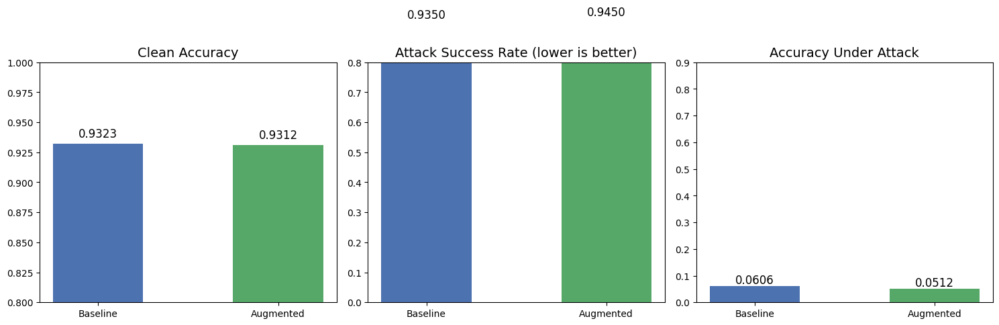
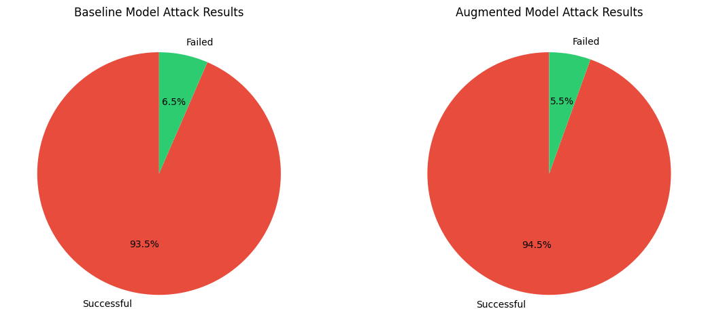
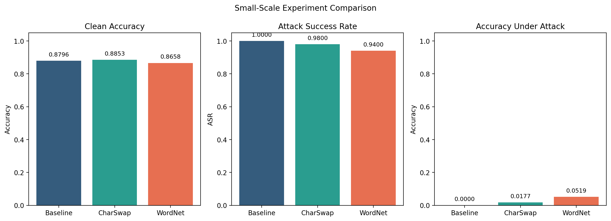

# Adversarial Robustness of BERT: First Report

---

## 1. Introduction

Large pre-trained language models such as BERT have achieved state-of-the-art results on many NLP benchmarks, including sentiment classification. However, recent work has shown that these models are highly vulnerable to adversarial attacks, that is, small semantically preserving perturbations to the input text that cause the model to produce incorrect predictions.

This project investigates the adversarial robustness of `bert-base-uncased` fine-tuned on the SST-2 (Stanford Sentiment Treebank) binary sentiment classification task. We evaluate vulnerability using the TextFooler attack (Jin et al., 2019) and explore whether adversarial data augmentation, using WordNet synonym substitution and character-level swaps, can improve robustness.

The repository now contains two layers of experimental evidence:
- the original full experiment reported in `report_en.md` and `report_zh.md`
- a lightweight local experiment added later for faster reruns, ablation, debugging, and visualization

## 2. Methodology

### 2.1 Baseline Model

We fine-tuned `bert-base-uncased` on the SST-2 training set (~67,349 samples) using the following hyperparameters:

| Hyperparameter | Value |
|---|---|
| Optimizer | AdamW |
| Learning rate | 2e-5 |
| Batch size | 32 |
| Max sequence length | 128 |
| Epochs | 3 |
| Weight decay | 0.01 |

### 2.2 Adversarial Attack: TextFooler

TextFooler (Jin et al., 2019) is a word-level adversarial attack that replaces words with semantically similar substitutes chosen to maximize the model's prediction error. The full experiment uses:
- counter-fitted word embeddings for synonym candidates
- Universal Sentence Encoder (USE) for semantic similarity constraints
- part-of-speech consistency checks

We attacked 200 correctly classified validation samples from each model in the full experiment.

For the lightweight local experiment, the same overall attack direction was kept, but the setup was reduced to make local reruns faster:
- `50` attack samples instead of `200`
- `random` sample selection with a fixed `seed`
- optional `--disable_use_constraint` to avoid the heavier USE dependency during quick local checks

### 2.3 Adversarial Data Augmentation

We generated augmented training data by applying two augmentation strategies, alternating per sample, to each of the 67,349 original training samples:

1. **WordNetAugmenter**: Replaces 20% of words with WordNet synonyms
2. **CharSwapAugmenter**: Swaps characters in 10% of words

This produced 67,349 augmented samples, combined with the original data for a total of 134,698 training samples.

For the lightweight extension in this repository, the augmentation pipeline was also made configurable so that smaller ablation runs can be executed directly from the command line.

### 2.4 Augmented Model

A fresh `bert-base-uncased` was fine-tuned on the combined dataset (134,698 samples) using identical hyperparameters for 3 epochs in the original full experiment.

The lightweight local experiment uses the same overall train-evaluate-attack pipeline, but with reduced scale such as `5000` training samples, `1` epoch, and per-strategy comparisons (`Baseline`, `CharSwap`, `WordNet`) for faster turnaround.

## 3. Results

### 3.1 Full Experiment Summary Table

| Metric | Baseline | Augmented | Delta |
|---|---|---|---|
| Clean Accuracy | 93.23% | 93.12% | -0.11 pp |
| TextFooler ASR | 93.50% | 94.50% | +1.00 pp |
| Accuracy Under Attack | 6.06% | 5.12% | -0.94 pp |

### 3.2 Lightweight Experiment Summary Table

| Method | Clean Accuracy | Attack Success Rate | Accuracy Under Attack |
|---|---:|---:|---:|
| Baseline | 0.8796 | 1.00 | 0.00 |
| CharSwap | 0.8853 | 0.98 | 0.02 |
| WordNet | 0.8658 | 0.94 | 0.06 |

### 3.3 Visualizations

Full experiment comparison (from notebook output):



Full experiment attack outcome distribution (from notebook output):



Lightweight experiment comparison:



### 3.4 Shared Findings

Both experiments point to the same high-level finding:
- BERT performs well on clean SST-2 inputs
- BERT is highly vulnerable to word-level adversarial attacks
- simple augmentation is not a reliable defense

### 3.5 Different Findings

The two experiments still show useful differences:
- the full experiment compares one baseline model against one combined augmented model, while the lightweight experiment separates `CharSwap` and `WordNet`
- the full experiment shows that the combined augmented model does not improve robustness and is slightly worse under attack
- the lightweight experiment suggests a mild trade-off split: `CharSwap` looks slightly better for clean accuracy, while `WordNet` looks slightly better for robustness
- the lightweight experiment is a faster local validation setup, not a replacement for the full report setting

### 3.6 What These Results Suggest

Taken together, the two experiments suggest that:
- naive augmentation can change the local balance between clean accuracy and robustness
- those local shifts do not automatically carry over to the full TextFooler setting
- the main conclusion of the report still holds: simple static augmentation is not sufficient against a strong adaptive word-level attack
- more targeted defenses, such as adversarial training or robust fine-tuning objectives, are likely needed

### 3.7 Attack Examples

| Original Text | Perturbed Text | Label Flip |
|---|---|---|
| "it's a **charming** and often affecting **journey**" | "it's a **cutie** and often affecting **circuits**" | positive -> negative |
| "unflinchingly **bleak** and desperate" | "unflinchingly **eerie** and desperate" | negative -> positive |
| "allows us to hope that nolan is poised to embark a major **career** as a **commercial** yet **inventive** filmmaker" | "allows ourselves to hope ... a major **quarries** as a **commercialized** yet **imaginative** filmmaker" | positive -> negative |

### 3.8 Notebook Findings (`notebooks/analysis_executed.ipynb`)

The executed notebook confirms the same full-experiment metrics from loaded JSON results:

| Metric | Baseline | Augmented | Delta |
|---|---:|---:|---:|
| Clean Accuracy | 0.9323 | 0.9312 | -0.0011 |
| Attack Success Rate (ASR) | 0.9350 | 0.9450 | +0.0100 |
| Accuracy Under Attack | 0.0606 | 0.0512 | -0.0094 |

The notebook also records representative successful attack examples and performs an explicit success check:
- `ASR drop: -0.0100 (need >= 0.15) -> FAIL`
- `Augmented clean accuracy: 0.9312 (need >= 0.89) -> PASS`

Notebook files:
- `notebooks/analysis.ipynb`
- `notebooks/analysis_executed.ipynb`

## 4. Analysis and Discussion

### 4.1 Key Findings

1. **BERT is extremely vulnerable to TextFooler**: The full experiment baseline achieved 93.23% clean accuracy but suffered a 93.50% attack success rate. The lightweight experiment shows the same overall pattern: even when clean accuracy remains reasonable, adversarial success rates stay extremely high.

2. **Simple data augmentation did not improve adversarial robustness reliably**: In the full experiment, the augmented model maintained comparable clean accuracy (93.12%) but showed no robustness improvement. In the lightweight experiment, `CharSwap` and `WordNet` shift the trade-off differently, but neither changes the overall conclusion that the model remains fragile.

3. **Clean accuracy was easier to preserve than robustness**: The full experiment kept clean performance nearly unchanged, and the lightweight experiment also shows that small clean-accuracy differences do not translate into strong robustness gains.

### 4.2 Why Augmentation Failed to Improve Robustness

The lack of robustness improvement can be attributed to several factors:

1. **Mismatch between augmentation and attack strategies**: TextFooler uses sophisticated synonym substitutions guided by counter-fitted embeddings and semantic similarity constraints (USE), while our augmentation uses simpler WordNet synonyms and character swaps.

2. **TextFooler's adaptive nature**: TextFooler is an adaptive, iterative attack that queries the model and selects substitutions specifically to maximize prediction error. Static data augmentation cannot defend against such targeted perturbations.

3. **Insufficient augmentation strength**: WordNet synonyms and character swaps produce relatively mild perturbations. More aggressive augmentation techniques, such as adversarial training with model-in-the-loop perturbations, may be needed.

4. **High baseline vulnerability**: With a very high ASR in both settings, BERT's vulnerability is severe enough that simple augmentation is insufficient as a meaningful defense.

### 4.3 Implications

These results highlight an important lesson: **not all data augmentation improves adversarial robustness**. The type and strength of augmentation must be matched to the threat model. For defending against sophisticated attacks like TextFooler, more targeted approaches are needed:
- adversarial training
- certified defenses
- robust fine-tuning methods such as FreeLB, SMART, or R3F

## 5. Conclusion

This project demonstrated that `bert-base-uncased` fine-tuned on SST-2 achieves strong clean accuracy but is extremely vulnerable to TextFooler adversarial attacks. The original full experiment showed that adversarial data augmentation using WordNet synonyms and character swaps preserved clean accuracy but did not improve robustness against TextFooler. The later lightweight local experiment in this repository supports the same high-level conclusion while also showing that different augmentation types may shift the local clean accuracy versus robustness trade-off in different directions.

The negative result is itself informative: it shows that naive data augmentation is insufficient against sophisticated word-level adversarial attacks, and that more advanced defense mechanisms are needed.

## 6. References

1. Devlin, J., et al. (2019). BERT: Pre-training of Deep Bidirectional Transformers for Language Understanding. NAACL.
2. Jin, D., et al. (2019). Is BERT Really Robust? A Strong Baseline for Natural Language Attack and Defense. arXiv:1907.11932.
3. Socher, R., et al. (2013). Recursive Deep Models for Semantic Compositionality Over a Sentiment Treebank. EMNLP.
4. Zang, Y., et al. (2020). Word-level Textual Adversarial Attacking as Combinatorial Optimization. ACL.

## 7. Repository Structure

- `src/train.py`: train baseline or augmented BERT models
- `src/evaluate.py`: evaluate clean accuracy
- `src/augment.py`: generate augmentation data
- `src/attack.py`: run adversarial attacks
- `src/plot_small_scale_results.py`: generate the lightweight result plot and CSV
- `report_en.md`: English report
- `report_zh.md`: Chinese report
- `docs/full_comparison_chart.png`: full experiment comparison chart
- `docs/full_attack_distribution.png`: full attack outcome distribution
- `docs/small_scale_results.png`: lightweight result visualization
- `notebooks/analysis.ipynb`: notebook analysis workflow
- `notebooks/analysis_executed.ipynb`: executed notebook with saved outputs

## Appendix: Reproducibility

### Environment

- Python 3.12, PyTorch, Transformers, TextAttack
- Full report environment: CUDA with NVIDIA GeForce RTX 4060 Laptop GPU on Windows 11
- Lightweight local reruns in this repository may also use reduced CPU-only settings

### Pipeline Commands

Install dependencies:

```bash
# Install project dependencies
pip install -r requirements.txt
```

Run the original full experiment flow:

```bash
# 1) Train baseline model
python src/train.py --mode baseline

# 2) Evaluate baseline model on clean validation data
python src/evaluate.py --model_dir results/baseline_model

# 3) Run TextFooler attack on baseline model
python src/attack.py --model_dir results/baseline_model --num_samples 200 --sampling sequential

# 4) Generate mixed augmented training data
python src/augment.py --strategy mixed --output results/augmented_train.json

# 5) Train augmented model
python src/train.py --mode augmented --augmented_data results/augmented_train.json

# 6) Evaluate augmented model on clean validation data
python src/evaluate.py --model_dir results/augmented_model

# 7) Run TextFooler attack on augmented model
python src/attack.py --model_dir results/augmented_model --num_samples 200 --sampling sequential
```

Run a lightweight local comparison:

```bash
# 1) Train lightweight baseline model
python src/train.py --mode baseline --max_train_samples 5000 --save_strategy no --epochs 1 --output_dir results/baseline_5000_model

# 2) Evaluate lightweight baseline model
python src/evaluate.py --model_dir results/baseline_5000_model

# 3) Attack lightweight baseline model
python src/attack.py --model_dir results/baseline_5000_model --num_samples 50 --sampling random --seed 42 --disable_use_constraint --output results/baseline_5000_attack_light.json

# 4) Create lightweight augmented datasets
python src/augment.py --strategy charswap --max_samples 500 --output results/aug_charswap_500.json
python src/augment.py --strategy wordnet --max_samples 500 --output results/aug_wordnet_500.json

# 5) Train + evaluate + attack lightweight CharSwap model
python src/train.py --mode augmented --augmented_data results/aug_charswap_500.json --max_train_samples 5000 --save_strategy no --epochs 1 --output_dir results/charswap_500_model
python src/evaluate.py --model_dir results/charswap_500_model
python src/attack.py --model_dir results/charswap_500_model --num_samples 50 --sampling random --seed 42 --disable_use_constraint --output results/charswap_attack_light.json

# 6) Train + evaluate + attack lightweight WordNet model
python src/train.py --mode augmented --augmented_data results/aug_wordnet_500.json --max_train_samples 5000 --save_strategy no --epochs 1 --output_dir results/wordnet_500_model
python src/evaluate.py --model_dir results/wordnet_500_model
python src/attack.py --model_dir results/wordnet_500_model --num_samples 50 --sampling random --seed 42 --disable_use_constraint --output results/wordnet_attack_light.json

# 7) Build lightweight table + chart from actual outputs
python src/plot_small_scale_results.py

# 8) Execute notebook and save outputs (uses full-experiment JSON files)
jupyter nbconvert --to notebook --execute notebooks/analysis.ipynb --output analysis_executed.ipynb
```


